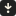

# Project 3: Spots

## **Welcome to my Spots Project!**
Check out my Repository on Github!:

https://github.com/tye-hoff/se_project_spots.git

Check out my video discussing this project in detail on Loom.com!:

https://www.loom.com/share/625c683252dc45c89d7f2b3728d62e6b?sid=5b68b46d-dd44-49f2-96a5-b3786c825147

# Overview
- Brief Description
- Features
- Figma
- Images

## Brief Description:

-This project is made so all the elements are displayed correctly on popular screen sizes. 
It was important to invest more time in completing this project, since it requires a higher skill level than the previous projects.

 Attention to detail was necessary when designing with the new concept of an interactive layout in mind.

As far as future updates are concerned; I will most liekly be searching for ways to consolidate my css blocks for easier reading and organization. 

## Features

1. BEM File Structure.
2. Flexbox.
3. Grid display.
4. Media Queries.
5. Figma.
6. Hover effects & Buttons.

## 1. *BEM File Structure*

This project and my last feature a BEM file structure. BEM is a simple acronym that stands for:
* **B**locks    (**B**): *-Represents a self-contained component on a page, (a header, navigation bar, or card).* 
* **E**lements  (**E**): *-A child component within a block, like a button inside a card or a list item within a navigation menu.* 

* **M**odifiers (**M**): *-A variation of a block or element, used to change its appearance or behavior, like adding a "disabled" state to a button or a "large" size to a text element.* 


BEM ensures that every part of your code has a clear, consistent, and descriptive name. Doing this not only makes your code more organized and easier to read, it also lowers the chance of experiencing conflicts in your code. 

## 2. *Flexbox*

Flexbox proved useful again. In my previous projects, The flexbox property appeared many times due to it's versatile nature. This project was no different. With my knowledge entering this project; Flexbox was the easiest way to form containers for a visual layout that matched the dimensions and styles specified in the design brief.

Flex box (syntax: display: flex;) was applied to the following blocks and their corresponding selectors. They list as follows:

```css
.header {
    display: flex;
    justify-content: center;
}

.profile {
    display: flex;
}

.profile__column {
    display: flex;
    flex-direction: column;
}

.card__content {
    display: flex;
    align-items: center;
    justify-content: space-between;
}
```


* After applying flexbox (display: flex;) to the selectors inside their respective blocks, all that was left to do was to adjust familiar flexbox style parameters such as justify-content, align-items, flex-direction, Etc.

## 3. *Grid display*

As for the grid display; this technique affords a developer an impressive amount of control in regards to interactive and adaptable design and layout. 
    
* To use the "cards.css" block as an example, the ".cards__list {}" selector inside the "cards.css" block has the following syntax within its curly brackets in order to achieve grid display. The syntax inside the curly brackets of the ".cards__list {}" selector list as follows:

```css
.cards__list {
    display: grid;
    grid-template-columns: repeat(auto-fit, 413px);
    justify-content: center;
}
```
* As the syntax states, the "display: grid;" achieves the initial grid display, but it is then specified further with the following rule:

```css
grid-template-columns: repeat(auto-fit, 413px);
```
    
* This rule allows the grid to "auto-fit" to smaller, default screen sizes like desktops and tablets to ensure a user friendly layout.

* Lastly, to be certain the item stayed centered I implemented the rule:
```css    
justify-content: center;
```

This property was novel to me, but became simple to implement with some studying and practice.


## 4. *Media Queries & Interactive display*

As stated earlier, this project is made so all the elements are displayed correctly on popular screen sizes.

In order to achieve a layout that is compatible with all major screen sizes (smartphones, tablets, etc.) the utilization of media queries became necessary in order to acheive these interactive results with both precision and efficiency.

The utilization of media queries works as a class selector for style rules of the same element. For example: the "card" & "cards" class (among all other elements) were styled to fit the desktop view. So, in order to achieve proper display for a mobile screen view; it was necessary to set a media querie that specifies both "screen" and "max-width" for the mobile view.

* For the media querie In this project, I used the following syntax:


```css
@media screen and (max-width: 627px) {
}
```

* In this instance, we'll use the "card.css" block as an example to illustrate this concept. In essence, this media querie granted me the ability to nest the mobile view styles of the following class selectors inside the curly brackets of the media querie.


* The class selectors nested inside the mobile view media querie list as follows:


* Selectors & Styles BEFORE being nested in Media Querie:
```css
.card {
  width: 413px;
  height: 445px;
  margin: 0;
}

.card__image {
  height: 413px;
  width: 413px;
  margin: 0;
  object-fit: cover;
  display: block;
  border-radius: 8px;
}

.card__title {
  margin: 0;
  font-family: Poppins, Arial, Helvetica, sans-serif;
  font-weight: 500;
  font-size: 20px;
  line-height: 24px;
  padding-top: 12px;
  text-overflow: ellipsis;
  overflow: hidden;
  color: #212121;
}

.card__content {
  display: flex;
  margin: 0;
  justify-content: space-between;
  align-items: baseline;
}

.card__like-button {
  padding: 12px 12px 8px 12px;
  margin: 0;
  background-image: url(../images/like\ icon\ Union.svg);
  background-repeat: no-repeat;
  border: none;
  background-color: transparent;
  opacity: 40%;
  cursor: pointer;
}
```

* Selectors & Styles AFTER being nested withing Media Querie:

```css
@media screen and (max-width: 627px) {
  
  .card {
    width: 288px;
    height: 318px;
    gap: 12px;
  }

  .card__image {
    height: 288px;
    width: 288px;
  }

  .card__content {
    width: 288px;
    height: 18px;
  }

  .card__title {
    padding-bottom: 20px;
    font-size: 16px;
    line-height: 16px;
    text-align: left;
  }

  .card__like-button {
    width: 20px;
    height: 18px;
  }
}
```

* From here, I was easily able to delete the desktop styles, to apply the mobile view screen style & size elements inside the curly brackets of our newly included media querie class selectors.

* Notice the styles values that did not need to be changed for the mobile view in the media querie, were omitted from inclusion within the media querie.

* Doing so allows me to manipulate the mobile phone view and layout, with out compromising the original default layout for the desktop view.


In theory, the media querie technique sounds more difficult than it is. Once understood, it translates smoothly into practice.


## 5. *Figma*
    
### - Important to note; this project was my first time exploring the use cases of figma as the primary design and style blueprint tool.

* After I took the time to explore and learn figma, I was pleasantly surprised with it's intuitive user interface. It effectively and efficiently streamlined the process of accessing styles.

Using figma to quicky extract small details and styles such as typography, images, logos, dimensions, etc., was exceedingly helpful. It truly did impact my workflow postively; It is a uniquely efficient tool.


## 6. *Hover effects on Buttons*

Hover effects on buttons are a staple of webpage design. These small details bring the webpage to life by transforming or transitioning elements when a cursor hovers over them. 

* They are quick and simple to implement using pseudo classes, I will show the original class, and the new pseudo class below.

* **Original Class**:

```css
.profile__add-btn {
  padding: 18px 32px 18px 32px;
  gap: 8px;
  border-radius: 8px;
  margin-bottom: 0;
  margin-left: auto;
  margin-top: auto;
  background-color: #212121;
  border: none;
  cursor: pointer;
  display: flex;
  justify-content: center;
  font-family: Poppins, Arial, Helvetica, sans-serif;
  font-size: 16px;
  font-weight: 500;
  line-height: 16px;
  color: #fcf5e5;
}
```


* **Pseudo Class**:


```css
.profile__add-btn:hover {
  transition: opacity 0.25s ease-in-out;
  opacity: 0.8;
}
```


* I'll use the ".profile__add-btn" inside the "profile.css" block for an example. The design brief required a smooth transition that changed the opacity of our button.


* In order to accomplish this, first I created a "hover" pseudo class for the .profile__add-btn using the following syntax:


```css
.profile__add-btn:hover {

}
```

* Second, inside the curly brackets of the pseudo class; I specified changes for the hover effect. The design commands inside the curly brackets of the pseudo class list as follows:

```css
.profile__add-btn:hover {
    transition: opacity 0.25s ease-in-out;
    opacity: 0.8s;
}
```

This easy technique consistently delivers rewarding results.

## Figma 

### [Link to the project on Figma](https://www.figma.com/file/BBNm2bC3lj8QQMHlnqRsga/Sprint-3-Project-%E2%80%94-Spots?type=design&node-id=2%3A60&mode=design&t=afgNFybdorZO6cQo-1)

## Images

### *Images Listed Below*:

###  -Header Logo


### -Cards.css


### -Profile.css


### -Card.css


### -Favicon.ico

